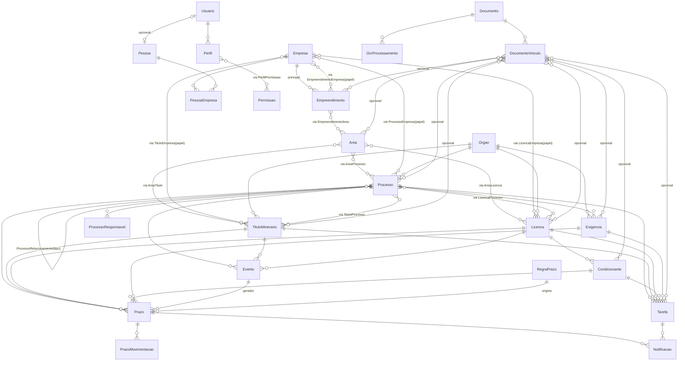

# AAM Ambiental & Mineral — ETAPA 4
## Arquitetura de Código e Estratégias Técnicas

Este documento descreve a arquitetura de pastas do Next.js, as estratégias de
autenticação/autorização, object storage, OCR futuro, auditoria e jobs/cron,
além do ERD final. **Ainda não há implementação de telas CRUD, motor de regras,
OCR, integrações externas ou relatórios completos** — apenas a base para o MVP.

---

## 1. Stack

| Camada | Tecnologia |
|---|---|
| Frontend/Backend | Next.js 16 (App Router) + TypeScript |
| Banco | PostgreSQL (Neon) |
| ORM | Prisma 6 |
| Deploy | Vercel |
| Jobs/Workers/assíncrono | Render (backend/worker separado) |
| Arquivos | Object Storage compatível S3 / Vercel Blob / Cloudflare R2 |
| OCR | estrutura preparada (OcrProcessamento), provedor a definir |

---

## 2. Estrutura de pastas (Next.js App Router)

```
amm-nagalli-cia/
├─ prisma/
│  ├─ schema.prisma        # MODELO DEFINITIVO (validado)
│  ├─ seed.ts              # catálogos + perfis + permissões
│  └─ sql/constraints.sql  # CHECKs que o Prisma não expressa
├─ src/
│  ├─ app/
│  │  ├─ (auth)/login/     # tela de login
│  │  ├─ (app)/            # área autenticada
│  │  │  ├─ dashboard/page.tsx
│  │  │  ├─ processos/...      # hub (Resumo, Timeline, Prazos, Tarefas, Docs, Exigências...)
│  │  │  ├─ empresas/...
│  │  │  ├─ empreendimentos/...
│  │  │  ├─ areas/...
│  │  │  ├─ pessoas/...
│  │  │  ├─ orgaos/...
│  │  │  ├─ titulos/...
│  │  │  ├─ licencas/...
│  │  │  ├─ prazos/...
│  │  │  ├─ tarefas/...
│  │  │  ├─ documentos/...
│  │  │  ├─ relatorios/...
│  │  │  └─ config/...
│  │  ├─ api/
│  │  │  ├─ auth/[...nextauth]/route.ts
│  │  │  ├─ empresas/route.ts + [id]/route.ts
│  │  │  ├─ processos/route.ts + [id]/route.ts
│  │  │  │   └─ [id]/eventos|prazos|tarefas|documentos|exigencias|relacionamentos/route.ts
│  │  │  ├─ titulos/...  licencas/...  condicionantes/...  exigencias/...
│  │  │  ├─ prazos/...   tarefas/...
│  │  │  ├─ documentos/route.ts + [id]/download/route.ts + [id]/ocr/route.ts
│  │  │  ├─ orgaos/...   areas/...  pessoas/...
│  │  │  └─ usuarios/... perfis/...
│  │  ├─ layout.tsx
│  │  └─ globals.css
│  ├─ components/
│  │  ├─ ui/            # Button, Card, Badge, Input, Modal, StatusBadge...
│  │  ├─ layout/        # Sidebar, Topbar, AppChrome, UserMenu
│  │  ├─ tables/        # DataTable (genérica)
│  │  ├─ forms/         # EntityForm (declarativo)
│  │  └─ docs/          # DocumentViewer, OcrReview
│  ├─ lib/
│  │  ├─ prisma.ts
│  │  ├─ auth.ts        # NextAuth config
│  │  ├─ perfil.ts      # autorização por permissão
│  │  ├─ audit.ts       # grava Historico
│  │  ├─ storage.ts     # upload/download Object Storage
│  │  ├─ prazos.ts      # motor de cálculo de prazo (futuro)
│  │  ├─ ocr.ts         # despacha OcrProcessamento (futuro)
│  │  ├─ validators/    # zod
│  │  └─ constants.ts
│  ├─ types/
│  └─ middleware.ts     # guarda de rota/autenticação
├─ worker/              # (Renderer) jobs de prazos/notificações — futuro
│  └─ index.ts
├─ scripts/
├─ .env.example
├─ next.config.ts
└─ package.json
```

**Princípio de organização (item 24 da Fase 2):** cada entidade NÃO vira,
necessariamente, um menu. Evento, Prazo, Tarefa, Documento, Exigência, Timeline
e Relacionamentos aparecem **como abas dentro da tela do Processo** (hub). As
rotas `api/...` existem por recurso, mas a experiência concentra tudo no processo.

---

## 3. Estratégia de autenticação e autorização

- **Autenticação:** NextAuth v5 (Credentials + bcrypt). Sessão JWT.
- **Autorização:** baseada em **permissões**, não apenas perfil binário.
  - `Perfil` (Administrador, Técnico) → `PerfilPermissao` → `Permissao` (`chave` = `"modulo:acao"`).
  - Helper `requerPermissao(usuario, "processo:editar")` central em `src/lib/perfil.ts`.
  - Middleware de rota + checagem server-side por chamada de API.
- Perfis iniciais: **Administrador** (tudo) e **Técnico** (ler/criar/editar nos
  módulos operacionais, sem excluir e sem config/usuários). Catálogo permite novos perfis.
- Auditoria de login/logout e de ações críticas via `Historico`.

---

## 4. Estratégia de Object Storage

- **Bytes fora do banco.** Banco guarda metadados em `Documento` (`storageKey`,
  `mime`, `tamanho`, `hash`).
- `storageKey` único aponta para Vercel Blob (S3-compatível; migrável para R2/S3).
- `hash` (SHA-256) para integridade e detecção de upload duplicado.
- `DocumentoVinculo` permite **um arquivo em N contextos** sem duplicação.
- Upload autenticado e auditado; download com checagem de permissão + auditoria.
- Não implementado ainda: apenas a estratégia e as entidades.

---

## 5. Estratégia de OCR futuro

- Entidade `OcrProcessamento` separada de `Documento` (histórico de tentativas).
- Fluxo planejado: `Documento → OcrProcessamento (status) → texto + campos →
  revisão humana (revistoPorUsuarioId/revistoEm) → atualização de dados`.
- Providência: **não escolher provedor definitivo**; `provedor` é campo livre
  (ocr.space, Tesseract, AWS Textract, Google Vision).
- Implementação adiada; estrutura já preparada (não bloqueia evolução).

---

## 6. Estratégia de auditoria (Historico)

- **Única exceção a `entidadeTipo + entidadeId`:** `Historico` não pode ter FK
  para o alvo (que pode ser deletado). `tipoEntidadeId` referencia o catálogo
  `TipoEntidade` (integridade do *tipo*); `entidadeId` é o id do registro.
- Grava: quem (usuarioId), quando (criadoEm), ação, campo, valorAnterior,
  valorNovo.
- **Nunca** registrar dados sensíveis (senha, conteúdo de arquivo, OCR integral).

---

## 7. Estratégia de jobs/cron (prazos e notificações) — Render

- Worker em **Render** (nó separado) roda em agendamento.
- Responsabilidades planejadas:
  - recalcular `Prazo.dataCalculadaAtual` conforme `PrazoMovimentacao`;
  - avançar status (futuro → próximo → vencendo hoje → vencido);
  - gerar `Notificacao` conforme `antecedenciaNotificacao` da `RegraPrazo`;
  - gerar tarefas recorrentes de condicionantes periódicas.
- Segurança: chamada autenticada por `CRON_SECRET` compartilhado (Vercel↔Render).
- **Implementação adiada** — apenas estratégia e modelo prontos.

---

## 8. ERD final (Mermaid)



---

## 9. Decisões técnicas relevantes (resumo)

- **Empresa × Empreendimento:** N:N com papel via `EmpreendimentoEmpresa`, mais
  `empresaPrincipalId` (obrigatório) como facilitador de consulta — justificado
  porque todo empreendimento tem, na prática, uma empresa principal.
- **Licença × Empreendimento:** `empreendimentoId` **opcional** (licença pode
  existir antes do vínculo definitivo).
- **DocumentoVinculo:** FKs explícitas + CHECK ≥1 alvo + índices por alvo.
- **Prazo:** `dataCalculadaOriginal` nunca sobrescrita; `dataCalculadaAtual`
  derivada de `PrazoMovimentacao`.
- **Catálogos:** seed + editáveis/inativáveis; entidades de sistema marcadas com
  `sistema=true` (protegidas de exclusão).
- **Soft delete:** `ativo` + `deletedAt` em todas as entidades críticas.
- **Unicidade:** `Empresa.cnpj` e `Pessoa.documento` parcial; `Processo.numero`,
  `TituloMinerario.numero`, `Licenca.numero` e `Documento.hash` **NÃO** são
  únicos globais (dependem do órgão/contexto).
